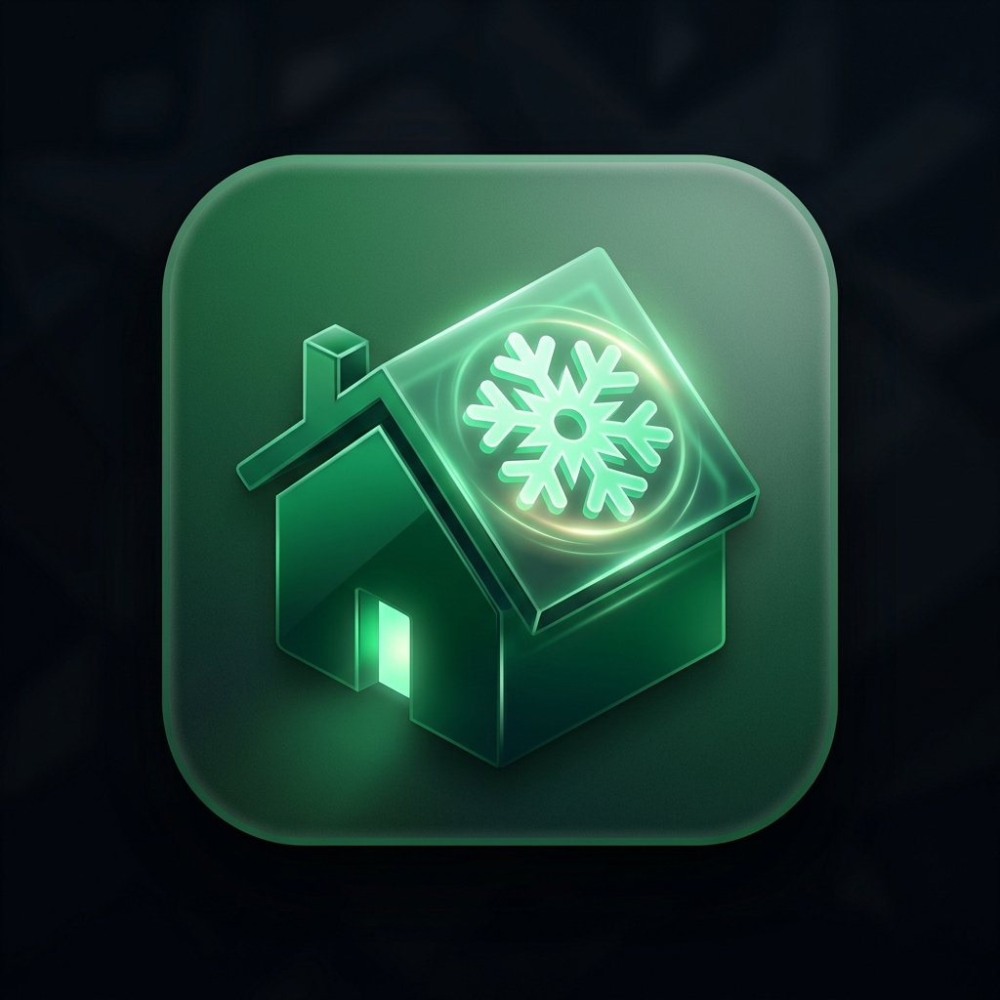
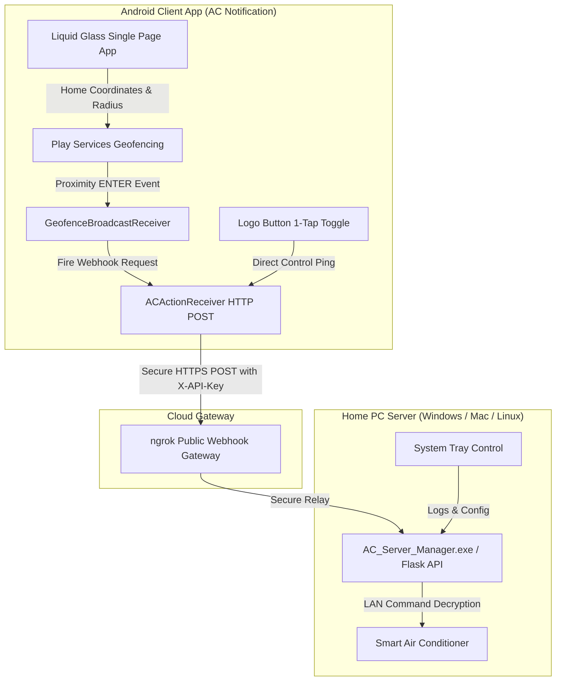

# AC Notification — Proximity-Based Smart Home Climate Automation

  

**AC Notification** is an ultra-modern, location-aware Android application and server suite designed to optimize home comfort and energy efficiency. It monitors a precision geofence around your home and automatically activates your Air Conditioner as you approach, ensuring your home is perfectly cooled before you step through the door.

---

## 🌟 Key Highlights & Features

### 1. 🎨 Liquid Glass iOS 27 Design & Material You Colors
* **Signature Dark Glass Aesthetic**: Translucent glass panels with real-time backdrop blurs (`blur-24px`), inset highlights, and dynamic Cyber Cyan accents (`#5DE6FF`).
* **Material You Integration**: Automatically extracts dynamic system color palettes from Android 12+ wallpaper settings.

### 2. ❄️ Dual-State Pro Logo Vector & 1-Tap Power Toggle
* **Pro Ambient Glass Aura**: Ambient radial glow halo around the top-left logo button that shifts dynamically:
  * **Soft Pink Translucent Halo (`#FF3B30` Vector)** when AC is ON (ready to turn OFF).
  * **Neon Cyan Translucent Halo (`#5DE6FF` Vector)** when AC is OFF (ready to turn ON).
* **1-Tap Direct Control**: Tapping the logo queries live AC status from the server and toggles power instantly.

### 3. 🎯 Precision Geofence Radius Control (3-in-1 Control)
* **Continuous Precision Slider**: Drag or scroll smoothly to set any exact radius between `50M` and `2000M` in 10m steps.
* **Segmented Glass Preset Pills**: Equal-width glass pills (`50M`, `250M`, `500M`, `1KM`) for instant 1-tap preset jumps.
* **Fine-Tuning Stepper**: `[-]` and `[+]` buttons to increment/decrement by 50m.

### 4. 🧭 Floating Signature Liquid Glass Navigation Capsule
* **Dead-Center Grid Layout**: 100% horizontally centered floating navigation bar across all screen aspect ratios with equal 33.33% column distribution.
* **Full Solid Glyph Highlighting**: Icons for **Dashboard**, **Permissions (Shield)**, and **Settings** illuminate and fill completely (`'FILL' 1` in Cyber Cyan) when active.

### 5. 🚀 5-Step Interactive Welcome & Setup Wizard
* **Automatic First-Run Detection**: Full-screen Liquid Glass wizard that guides first-time users through:
  1. **Architecture & Overview**: Visual proximity cooling flow.
  2. **Server Pairing & PC Guide**: Webhook URL & Secret Key input with live `[ ⚡ Test Connection Ping ]` validation and direct link to the standalone Windows executable.
  3. **Target Home Location**: Address search + `[ My Location ]` GPS pin + radius setup.
  4. **System Authorizations**: 1-tap permission grants for Location, Background Location ("Allow All The Time"), Notifications, and Unrestricted Battery with live green `✓ GRANTED` status badges.
  5. **Verification & Launch**: Compliance score (`100%`) and `[ 🚀 Launch Dashboard ]` action.

### 6. 💻 Standalone Windows PC Server Manager (`AC_Server_Manager.exe`)
* **Zero Python / Zero Pip Required**: A single, standalone Windows `.exe` installer. End-users don't need Python installed!
* **Auto-Discovery Wizard**: Scans local Wi-Fi to auto-detect Midea/Electra ACs in 1 click.
* **Auto-Tunneling & Webhook Display**: Automatically starts the ngrok tunnel and provides 1-click `[ Copy Endpoint URL ]` and `[ Copy Secret Key ]` buttons.
* **System Tray Integration**: Runs quietly in the Windows Notification Area with a right-click menu and 1-click Windows boot auto-start registration.

---

## 🔌 Hardware & Server Compatibility

| Category | Supported Devices & Platforms |
| :--- | :--- |
| **Native PC Server Script (`midea_server.py`)** | Midea, Electra, Carrier, Toshiba, Comfee, Inventor, MDV, Kaysun, Kaisai Wi-Fi ACs |
| **Universal Webhook Architecture** | Home Assistant, Node-RED, Tuya, SmartThings, Tado, Sensibo, Broadlink IR, Custom HTTP Servers |

---

## 🛠 System Architecture

---

## 🚀 Quick Start Guide

### 1. Download Mobile App & Server Manager
- Download **[`ac-notification-app.apk`](ac-notification-app.apk)** for Android.
- Download **`AC_Server_Manager.exe`** from the `midea-ac-server/dist/` folder for Windows.

### 2. Run Windows Server Manager
1. Double-click `AC_Server_Manager.exe` on your PC connected to home Wi-Fi.
2. Click **`🔍 Auto-Discover Wi-Fi AC`** to automatically detect your air conditioner.
3. Click **`📋 Copy Endpoint URL`** to get your public ngrok Webhook URL (`https://...ngrok-free.app/api/v1/ac/trigger`).

### 3. Open Mobile App & Complete Setup Wizard
1. Open **AC Notification** on your Android phone.
2. The **Welcome Setup Wizard** will automatically launch.
3. Paste your Webhook URL & Secret Key in Step 2, tap `[ ⚡ Test Connection Ping ]`, authorize permissions in Step 4, and tap **`Launch Dashboard`**!

---

## 📜 License & Acknowledgments
Built with ❤️ using Android Jetpack, Compose, Leaflet.js, OpenStreetMap, Tailwind CSS, Flask, `msmart-ng`, and ngrok.
