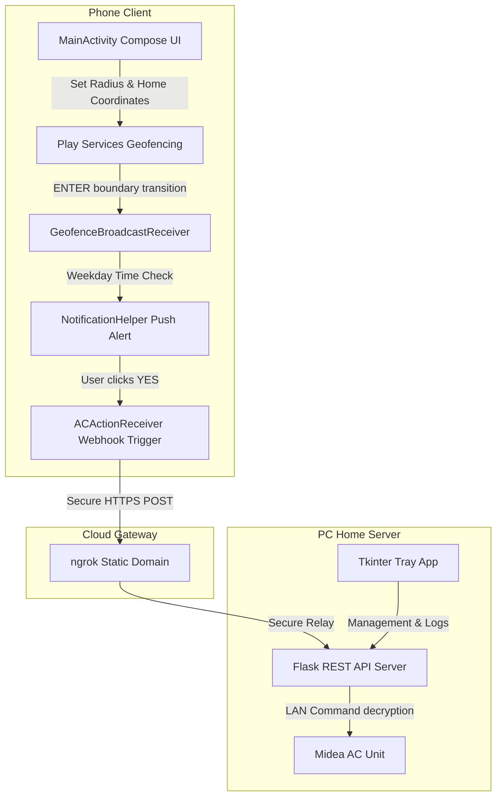

# AC Proximity Alert & Control System

<p align="center">
  
</p>

A location-aware automated AC activation system. The project features an Android app that monitors a geofence around your home. When you physically enter the geofence boundary during weekday hours, a push notification prompt asks if you want to turn on the AC. Tapping "YES" triggers a secure background webhook relayed through ngrok to your local Midea/Electra AC server.

---

## Key Features

### 📱 Android Application
* **Material You Integration**: Automatically adapts to your phone's current wallpaper colors and active theme.
* **Leaflet Map Overlay**: Embedded Dark-mode CartoDB map that visualizes your geofence boundary in real-time.
* **Custom Radius Slider**: Adjusts geofence radius from `50m` up to `1000m` in real-time.
* **Fused Location Provider**: High-precision geofencing using Google Play Services API with background location awareness.
* **Battery Optimized**: Runs efficiently with fine-tuned location responsiveness and 30-minute GPS drift cooldown guard.

### 💻 Windows Background Client
* **Quiet System Tray Control**: Low-overhead background application (`pythonw.exe`) with a custom status icon.
* **Stealth Mode**: Toggle visibility to hide the tray icon completely while running in the background.
* **Log Viewer**: Integrated Tkinter GUI to review local server logs and connection events.
* **Ngrok Static Tunneling**: Secure local forwarding using a free static domain that survives reboots and IP renewals.
* **Single Instance Enforced**: TCP socket lock ensures only one active instance handles requests.

---

## Project Structure

```
├── ac-notification-app/    # Native Compose Android Application
├── midea-ac-server/        # Python Flask API & Windows System Tray Client
├── resources/              # Images, icons, and assets
└── ac-proximity-app.apk    # Compiled Android package for easy installation
```

---

## Architecture Flow



---

## Getting Started

### 1. Setup Local Server (PC)
1. Install Python 3.11+.
2. Download and install ngrok via Windows Package Manager:
   ```powershell
   winget install ngrok.ngrok
   ngrok config add-authtoken <YOUR_AUTH_TOKEN>
   ```
3. Claim a permanent free static domain on your [ngrok Dashboard](https://dashboard.ngrok.com/domains).
4. Clone this repository to your computer.
5. In the `midea-ac-server` directory, create a `config.json` containing:
   ```json
   {
     "ip": "YOUR_AC_LOCAL_IP",
     "device_id": "YOUR_MIDEA_DEVICE_ID",
     "token": "YOUR_MIDEA_DECRYPT_TOKEN",
     "key": "YOUR_MIDEA_DECRYPT_KEY",
     "api_key": "ac_secret_key_8497",
     "ngrok_domain": "your-assigned-domain.ngrok-free.dev"
   }
   ```
6. Double-click `start_ac_server.bat` to launch the background system tray app.

### 2. Setup Android Client
1. Install `ac-proximity-app.apk` on your Android device.
2. Open the app and grant permissions (Location, Background Location, Notifications).
3. Set your home coordinates using **📍 Set Current Location as Home**.
4. Adjust the warning radius slider (e.g. 350 meters).
5. Enter your Webhook URL:
   `https://your-assigned-domain.ngrok-free.dev/api/v1/ac/trigger`
6. Enter your configured `X-API-Key` (e.g. `ac_secret_key_8497`).
7. Toggle **Monitoring Active** to ON.
8. Tap **Disable Battery Optimization** to ensure Android doesn't suspend geofence checks.
