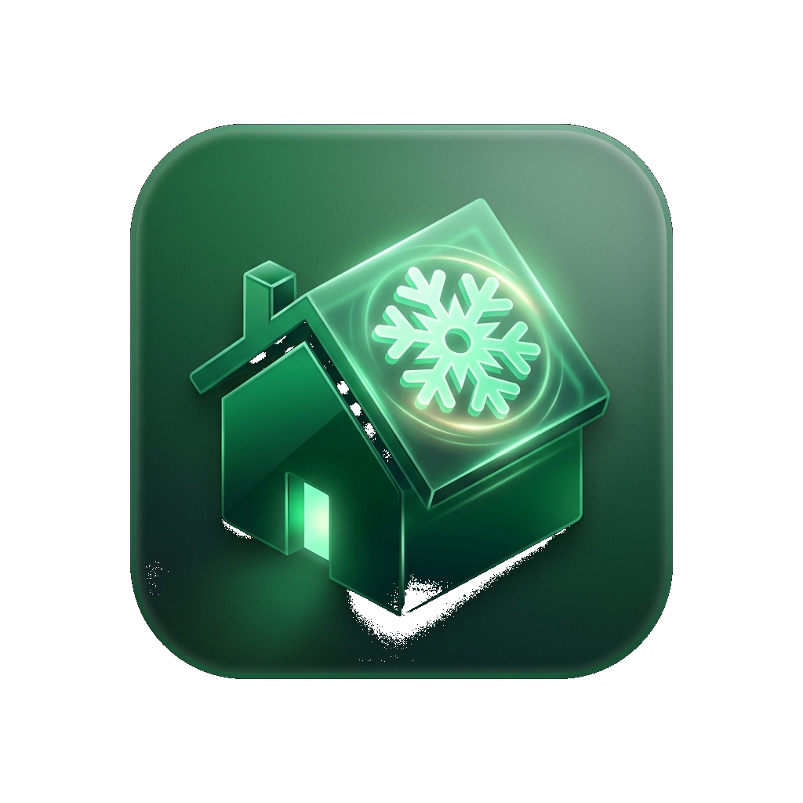
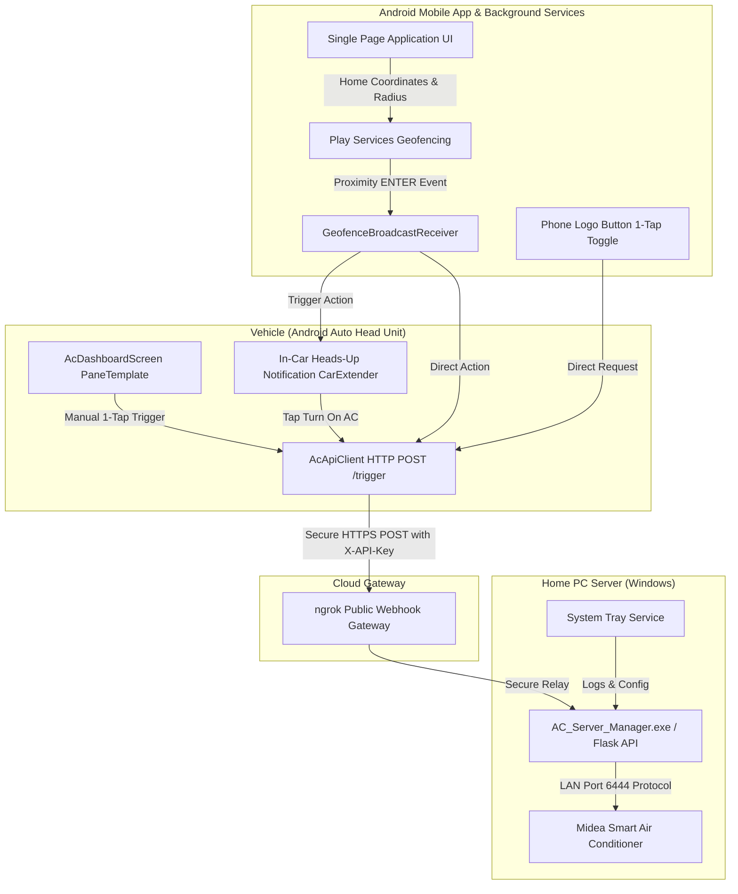

# AC Notification — Proximity-Based Smart Home Climate Automation

  

**AC Notification** is a location-aware Android and Android Auto application with a companion Windows server suite engineered to automate home air conditioning based on proximity. It creates a geofence around your home and automatically triggers your AC as you approach, ensuring optimal indoor temperature upon arrival.

---

## 🌟 Key Features

### 1. 🚗 Official Android Auto Integration (`androidx.car.app`)
* **In-Car Driver Dashboard (`PaneTemplate`)**: High-contrast, driver-safe vehicle touchscreen interface displaying live AC power status, target temperature preset (22.0°C Cool mode), and geofence telemetry.
* **In-Car Actionable Heads-Up Notifications**: `NotificationCompat.CarExtender` surfaces heads-up popups over Google Maps or Waze when crossing your home geofence, offering 1-tap **[Turn on AC ❄️]** and **[Dismiss]** buttons directly on the vehicle display.
* **Dynamic Material You In-Car Theme**: Car screen buttons, glows, and notification accents dynamically inherit your phone's wallpaper color palette.
* **Real-Time Execution Feedback**: `androidx.car.app.CarToast` overlays provide immediate visual confirmation on the vehicle head unit when signals are transmitted.

### 2. 🎨 Modern Mobile Interface & Liquid Glassmorphism
* **Obsidian Dark Aesthetic**: Dark theme with backdrop blurs, subtle glowing container borders, and vibrant Cyber Cyan accents (`#5DE6FF`).
* **Material You Integration**: Dynamically inherits system color palettes on Android 12+ devices.
* **Offline-Aware Amber Status Banner**: Smooth banner alerts when the server is unreachable, with automatic recovery upon reconnection.

### 3. ❄️ Dynamic Power Indicator & 1-Tap Toggle
* **Status Aura Halo**: The primary control button indicates AC status:
  * **Soft Pink Halo (`#FF3B30`)** when AC is ON (ready to turn OFF).
  * **Cyan Halo (`#5DE6FF`)** when AC is OFF (ready to turn ON).
* **1-Tap Direct Control**: Tapping the logo queries live server status and toggles AC power state directly.

### 4. 🎯 Precision Geofence Radius Control
* **Continuous Range Slider**: Smoothly adjust geofence radius from `50M` to `2000M` in 10-meter increments.
* **Preset Buttons**: Quick-select preset pills (`50M`, `250M`, `500M`, `1KM`).
* **Fine-Tuning Steppers**: `[-]` and `[+]` buttons to step radius by ±50m.

### 5. 🧭 Floating Navigation & Offline Recovery
* **Centered Grid Layout**: Horizontally centered navigation pill responsive across all screen aspect ratios.
* **Smart Retry on Failure**: If a webhook fails due to temporary signal loss while driving, a heads-up notification offers a 1-tap **[🔄 Retry]** button once connectivity returns.

### 6. 🚀 5-Step Guided Setup Wizard
* **First-Run Onboarding**: Guides users through:
  1. **System Overview**: Proximity cooling architecture explanation.
  2. **Server Pairing**: Webhook URL & Secret Key pairing with live `[ ⚡ Test Connection Ping ]` verification.
  3. **Home Location Setup**: Nominatim address search, `[ My Location ]` GPS pin drop, and radius configuration.
  4. **System Permissions**: 1-tap grants for Fine Location, Background Location ("Allow All The Time"), Notifications, and Unrestricted Battery usage.
  5. **Verification**: Live permission audit and dashboard launch.

### 7. 💻 Standalone Windows PC Server Manager (`AC_Server_Manager.exe`)
* **Single-File Executable**: Independent executable compiled via PyInstaller (no Python runtime required).
* **Wi-Fi AC Auto-Discovery**: Automatically scans local subnet (10.0.0.x / 192.168.x) for Midea/Electra units on port 6444.
* **Automated Tunneling**: Integrates ngrok public gateway with 1-click endpoint URL and secret key clipboard actions.
* **System Tray & Windows Startup**: Minimizes to Windows System Tray on close `[X]` for 24/7 background operation; includes native 1-click Windows boot startup registration.

---

## 🔌 Hardware & Platform Compatibility

| Category | Supported Systems |
| :--- | :--- |
| **Android Mobile & Android Auto** | Android 10+ (API 29+), Android Auto Head Units (Car API Level 1+) |
| **PC Server Gateway (`AC_Server_Manager.exe`)** | Midea, Electra, Carrier, Toshiba, Comfee, Inventor, MDV, Kaysun, Kaisai Wi-Fi ACs |
| **Universal Webhook Support** | Home Assistant, Node-RED, Tuya, SmartThings, Tado, Sensibo, Custom HTTP Endpoints |

---

## 🛠 System Architecture

---

## 🚀 Quick Start Guide

### 1. Download Mobile App & PC Server
- Download **[`ac-notification-app.apk`](https://github.com/ogadassi/ac-notification/releases/download/v2.0.0/ac-notification-app.apk)** for Android & Android Auto.
- Download **[`AC_Server_Manager.exe`](https://github.com/ogadassi/ac-notification/releases/download/v2.0.0/AC_Server_Manager.exe)** for Windows.

### 2. Run Windows Server Manager
> [!IMPORTANT]
> **📶 Network Requirement**: The PC running `AC_Server_Manager.exe` MUST be connected to the **same home Wi-Fi network** as your Air Conditioner. The server manages local AC commands over LAN, while ngrok securely receives pings over the internet.

> [!NOTE]
> **🛡️ Windows SmartScreen Notice**: When launching `AC_Server_Manager.exe`, Windows may display a standard *"Windows protected your PC"* prompt. Click **`More info`** → **`Run anyway`** to open.

1. Launch **`AC_Server_Manager.exe`**.
2. Click **`🔍 1. Auto-Discover Wi-Fi AC`** to confirm your AC unit on local Wi-Fi.
3. Click **`📋 2. Copy Webhook URL`** and **`🔑 Copy Secret Key`**.

### 3. Complete Mobile & In-Car Setup
1. Open **AC Notification** on your Android phone.
2. The **Setup Wizard** will launch automatically on first run.
3. Paste the Webhook URL & Secret Key in Step 2, run connection verification, grant system permissions in Step 4, and tap **`Launch Dashboard`**.
4. Connect your phone to your car via USB or Wireless Android Auto — **AC Proximity Automation** will appear in your car's app launcher with full dashboard controls and heads-up notifications.

---

## 📜 License & Acknowledgments
Built using Android Jetpack, `androidx.car.app`, Compose, Leaflet.js, OpenStreetMap, Tailwind CSS, Flask, `msmart-ng`, `pystray`, and ngrok.
